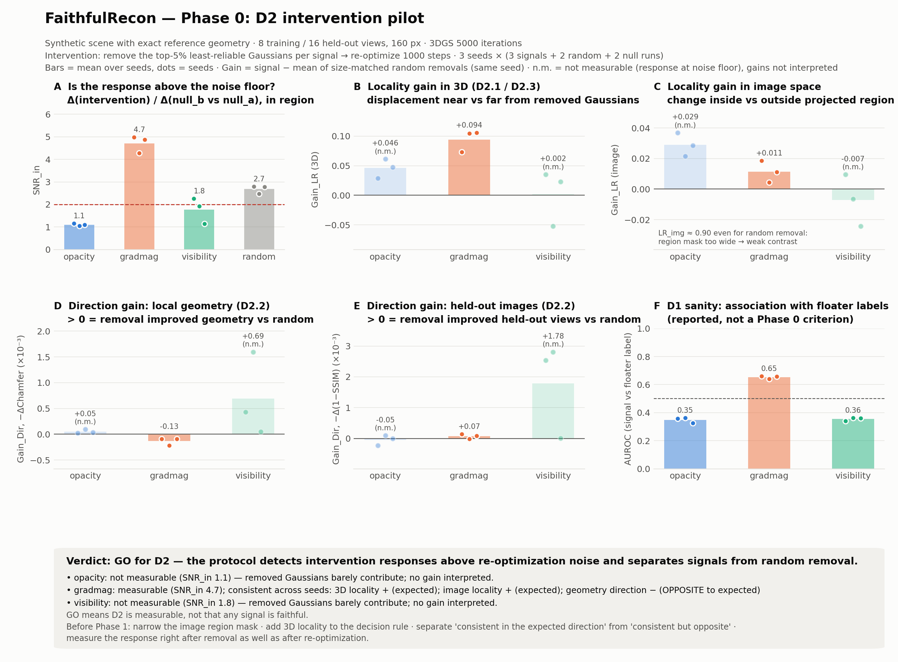

# FaithfulRecon

**An intervention-based protocol for evaluating spatial reliability signals in 3D Gaussian Splatting.**

## Overview

3D Gaussian Splatting (3DGS) represents a scene as a set of anisotropic Gaussian primitives and is
optimized with a 2D photometric loss. Besides that loss, many 3DGS pipelines compute an *internal
signal* per primitive, such as accumulated view-space gradient magnitude, opacity, second-order
sensitivity, Fisher information or uncertainty estimates, and use it to decide which primitives to
densify, prune or otherwise modify.

These signals are usually assessed by inspecting their visualizations or by the final reconstruction
quality of the method that uses them. Neither directly tests whether a signal identifies the
primitives associated with the failure it is meant to detect. A signal can look plausible, and even
correlate with error, while removing the primitives it selects leaves the failure in place or damages
valid structure such as thin parts.

FaithfulRecon is an **evaluation layer** for such signals. Rather than proposing another signal, it
asks whether a signal should be trusted before it is used to guide reconstruction, using controlled
interventions on scenes with known reference geometry.

The current scope is **spatial** reliability in **static** 3DGS, for geometric failure caused by
insufficient multi-view observation (sparse or restricted viewpoints), where floaters are the
typical outcome.

## Research questions

**Core question.** Can an internal reliability signal identify the Gaussian primitives associated
with geometric failure, and does intervening on the identified primitives produce the expected,
spatially localized response?

| | Question |
|---|---|
| **RQ1** Failure association | Do signals rank primitives inside benchmark-defined failure regions above other primitives, compared with random and heuristic baselines? |
| **RQ2** Intervention response | When the primitives selected by a signal are removed (or their opacity / position perturbed) and the model is re-optimized, is the change (a) concentrated near the selection, (b) in the direction the signal implies, and (c) different from a size-matched random selection by more than re-optimization noise? |
| **RQ3** Held-out predictive validity | Does the signal predict reconstruction error on views excluded from training? |
| **RQ4** Dissociation | Does good performance on RQ1 or RQ3 imply good performance on RQ2? Are there signals that predict failure but whose selected primitives do not produce a localized, direction-consistent response? |

Hypotheses (to be tested, none assumed):

- **H1.** Under controlled sparse-view settings, second-order signals show higher failure association than random and opacity baselines.
- **H2.** At least one commonly used signal performs well on RQ3 but is not better than random on RQ2.
- **H3.** At equal pruning ratios, signals with low intervention locality remove more thin-structure primitives.
- **H4.** The ranking of signals changes with the degree of under-observation.

## Operational definition of faithfulness

> A reliability signal is *faithful* to a failure mechanism to the extent that it identifies
> primitives whose intervention produces a change in the reconstruction that (i) is concentrated in
> the identified region and (ii) has the direction and magnitude expected under the signal's stated
> meaning, relative to a size-matched random selection.

This is an operational definition, not a claim about interpretability. Faithfulness is defined
for a *(signal, failure mechanism)* pair, and it is never reduced to a single scalar: it is assessed
from complementary evidence across three dimensions.

| Dimension | Evidence | Metrics | What it does **not** show |
|---|---|---|---|
| **D1** Failure association | Signal ranking agrees with benchmark-defined labels | AUROC, AUPRC, Precision@K, enrichment@K, Spearman vs. distance to surface | That intervening on the selected primitives fixes anything |
| **D2** Intervention response | Removing the top-K primitives changes the reconstruction locally, in the expected direction, beyond noise | Locality ratio, direction gain, gains vs. random, SNR vs. noise floor | Full causal identification; results hold for the tested interventions only |
| **D3** Held-out predictive validity | Signal predicts error on unseen views | Spearman, AUSE, AUROC vs. outcome labels | Intervention behavior (this is what RQ4 tests) |

## Method

### Controlled benchmark

Scenes have exact reference geometry, so failure can be labeled independently of every signal.
The default scene is procedural (a textured sphere, a box and three thin rods), represented as a
dense layer of flat, nearly opaque Gaussians from which ground-truth images are rendered. Camera
configurations are generated freely (number of training views, angular coverage). A loader for
NeRF-Synthetic scenes is included; reference geometry for those must come from the source meshes.

Two per-primitive labels are defined, deliberately separate:

| Label | Meaning | Depends on |
|---|---|---|
| `m_i` **condition** | primitive lies in an under-observed region (nearest reference point seen in fewer than *k* training views, or small triangulation angle) | cameras + reference surface only |
| `f_i` **outcome** | primitive is geometrically erroneous (center farther than τ from the surface) and visible on held-out views | trained model + reference surface |

```text
sparse views → under-observed region (m_i) → optimization ambiguity → geometric error (f_i)
```

Separating them distinguishes signals that track the *condition* that leads to failure (useful for
early intervention) from signals that only track the *outcome* after it has occurred.

### Signals evaluated

All signals output one score per primitive, higher = less reliable.

| Signal | Computed from | Role |
|---|---|---|
| Random | uniform noise | matched control |
| Opacity | `1 − α_i` | heuristic baseline |
| Gradient magnitude | mean view-space positional gradient norm (the 3DGS densification statistic) | heuristic baseline |
| Visibility | −(number of training views in which the primitive contributes) | coverage baseline |
| Cross-view gradient inconsistency | normalized covariance of per-view positional gradients | candidate |
| Fisher / second-order sensitivity | per-primitive curvature (FisherRF, PUP 3D-GS style) | literature baselines (planned) |
| `s_geom` | curvature term × gradient inconsistency | candidate hypothesis, not a proposed method |

### Intervention protocol (D2)

For each signal *E* and selection ratio *K*:

1. Select the top-*K* primitives by *E*, plus size-matched random selections.
2. Remove them (opacity scaling and position perturbation are planned variants).
3. Re-optimize for *T* steps from the checkpoint with densification off, so primitive identities are preserved.
4. Compare with a **null intervention** (re-optimization without removal) using the same view order.
   A second null run with a different view order gives the **noise floor**.

Measured quantities:

- **Locality** (size-normalized): `LR = d_in / (d_in + d_out)`, where `d_in` and `d_out` are mean
  per-pixel changes inside / outside the projected region of the selection, and the same ratio for
  the 3D displacement of surviving primitives near vs. far from the removed ones.
- **Direction**: `Dir = −Δ(error)` for held-out image error and for local Chamfer distance to the
  reference surface around the removed primitives. Positive means removal helped (or hurt less).
- **Matched contrast**: `Gain = metric(signal) − mean metric(random)` in the same seed, and
  `SNR_in = d_in(intervention) / d_in(null vs. null)`.

Three outcomes are distinguished: (i) a localized, direction-consistent response above the random
control (evidence for the signal); (ii) a response indistinguishable from the noise floor (the
selected primitives have little influence); (iii) a response in the opposite direction or spread
across the scene (the signal's stated meaning is not supported). Gains are only interpreted when the
response is measurable.

## Results so far: Phase 0 (D2 pilot)

Phase 0 checks whether D2 produces responses that can be separated from re-optimization noise
before the full study is run. Setup: synthetic scene, 8 training / 16 held-out views, 160 px,
3DGS 5000 iterations, removal of the top 5%, 1000 re-optimization steps, 3 seeds.



| Signal | SNR_in | Gain_LR (3D) | Gain_Dir (local Chamfer) | AUROC vs. `f_i` |
|---|---|---|---|---|
| Gradient magnitude | 4.71 ± 0.38 | +0.094 ± 0.019 | −0.00013 ± 0.00007 | 0.65 |
| Visibility | 1.77 ± 0.57 (not measurable in every seed) | – | – | 0.36 |
| Opacity | 1.10 ± 0.05 (not measurable) | – | – | 0.35 |
| Random (control) | 2.69 ± 0.18 | – | – | – |

Observations (mean ± std over 3 seeds):

- The protocol separates signals from random removal above re-optimization noise: the go/no-go
  rule returned **GO** for D2.
- Removing the gradient-magnitude selection gives a measurable, more localized response than random
  removal. However, local geometry ends up consistently *worse* than after random removal, which is
  outcome (iii). The signal selects influential primitives, but not the erroneous ones.
- Opacity selects near-transparent primitives whose removal changes nothing, which is outcome (ii).
- Image-space locality does not discriminate yet (LR ≈ 0.90 even for random removal) because the
  projected region of a 5% selection covers most of the object.

GO means D2 is measurable, not that any signal is faithful. Details: [docs/phase0.md](docs/phase0.md),
[results/phase0/report.md](results/phase0/report.md).

## Roadmap

| Step | Content | Status |
|---|---|---|
| Core | Differentiable rasterizer, 3DGS training with adaptive density control, synthetic scenes with reference geometry | done |
| Phase 0 | D2 pilot: 1 scene, 3 signals, removal at K = 5% | done (GO) |
| Protocol refinement | Narrower image regions, 3D locality in the decision rule, expected vs. opposite direction, response right after removal | next |
| Benchmark labels | Condition label `m_i` with occlusion-aware visibility; final `f_i`; threshold sweeps | in progress |
| Signals | Cross-view gradient inconsistency; Fisher / second-order baselines; `s_geom` | in progress |
| D1 pipeline | AUROC, AUPRC, Spearman, Precision@K, enrichment@K with matched random baselines | in progress |
| Phase 1 | D1–D3 on several scenes and view settings; all interventions and K values | planned |

## Repository layout

```text
frecon/                  library
├── camera.py, gaussians.py, losses.py, train.py, measure.py
├── render/              pure-PyTorch rasterizer (+ optional gsplat backend)
├── data/                procedural synthetic scene, NeRF-Synthetic loader
├── signals/             reliability signals (one module per signal)
├── benchmark/           reference geometry, geometric error, labels m_i / f_i
└── eval/                D1 metrics, matched random baseline, plots
scripts/                 phase0.py, analyze_phase0.py, make_phase0_figure.py, prepare_d1_run.py,
                         export_signals.py, make_labels.py, run_d1.py
configs/                 phase0.yaml, d1.yaml
tests/                   pytest
docs/                    data_format.md (file formats between components), phase0.md, research notes
results/                 small committed results (tables, figures)
runs/, data/             experiment outputs and datasets (not tracked)
```

## Setup

Python ≥ 3.10 with PyTorch (CUDA recommended; tests run on CPU). No compilation is needed: the
rasterizer is pure PyTorch and matches a dense reference implementation to ~1e-7 in both images and
gradients. With a gsplat build matching your Python/PyTorch/CUDA, set `renderer: gsplat` for speed.

```bash
pip install -r requirements.txt
pytest
```

## Reproducing Phase 0

```bash
python scripts/phase0.py --config configs/phase0.yaml --quick --seeds 0 1   # smoke test, minutes
python scripts/phase0.py --config configs/phase0.yaml                         # full run (~2 h on a 4 GB GPU)
python scripts/analyze_phase0.py --run_dir runs/phase0
python scripts/make_phase0_figure.py --run_dir runs/phase0
```

All stages are cached under `runs/`, so interrupted runs resume where they stopped.

## Limitations

- Ground-truth images of the procedural scene are rendered with Gaussian splatting, so the image
  formation is in-distribution for 3DGS; mesh-rendered scenes are needed for external validity.
- Labels depend on thresholds (k, θ, τ); results are to be reported across threshold values.
- Intervention evidence holds for the tested interventions and settings; it is not full causal
  identification.
- Phase 0 used 3 seeds; its decision rule is a pilot heuristic, not a significance test.

## Contributing

See [CONTRIBUTING.md](CONTRIBUTING.md) for the workflow, and [docs/data_format.md](docs/data_format.md)
for the file formats shared by the signal, benchmark and evaluation components.
